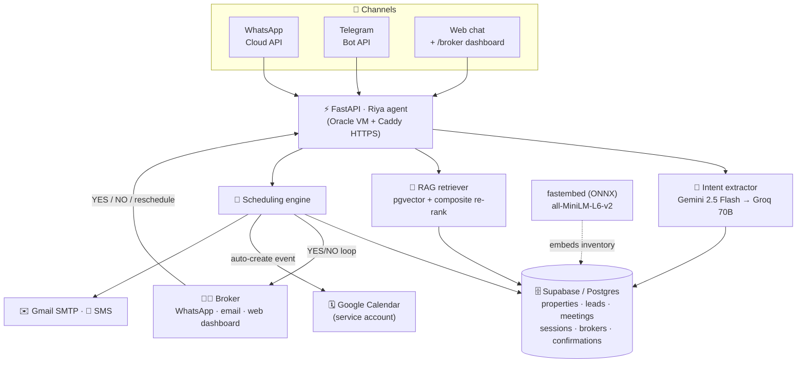
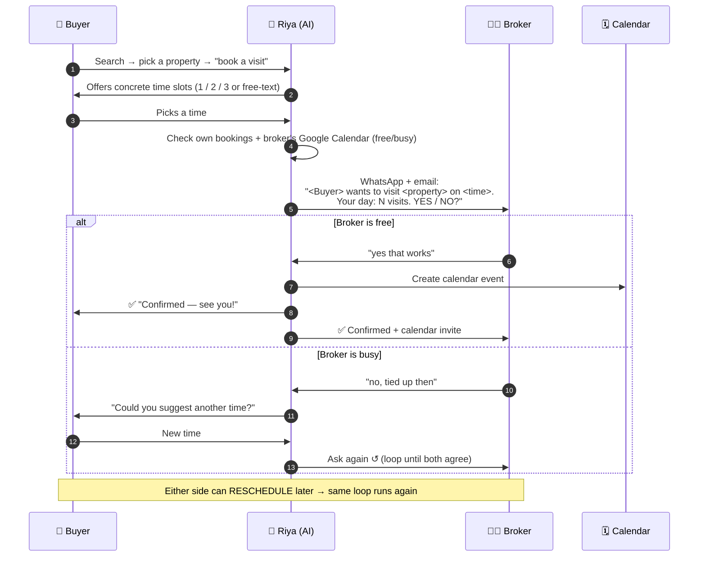

# 🏠 Riya — AI Real Estate Consultant (Lucknow)

Riya is a full-stack, **multi-channel** AI property assistant that takes a buyer from
*"I want a home"* all the way to a **confirmed site visit on the broker's Google Calendar** —
over **WhatsApp, Telegram, or the web** — while keeping a human broker in the loop the whole way.

> **Live:** `https://144-24-156-187.sslip.io` — customer chat at `/`, broker dashboard at `/broker`
> Runs 24/7 on an Oracle Cloud free VM behind auto-HTTPS (Caddy).

---

## ✨ What it does

- **Conversational property search** — RAG over a real Lucknow inventory (pgvector + hybrid re-ranking)
- Understands **budget, area, BHK, property type, nearby landmarks, live distances, amenities** — even from vague / roundabout messages
- Shows rich **property cards** with photo carousels, maps, distance badges, amenities
- **Favourites** — buyers save properties ("save the 2nd one") and book a visit from them
- **Two-way broker confirmation** — the AI messages the broker on WhatsApp *and* email → broker replies **YES/NO** → the visit is **auto-booked on Google Calendar** and both parties are notified
- **Full negotiation loop** — broker busy? → buyer is offered a new time → broker asked again → repeat until both agree
- **Reschedule from either side** (buyer or broker), any time
- **One collective view for the broker** — every lead & visit from *all* channels, on both the **web dashboard** and via **WhatsApp commands**
- **Day-before reminders** to buyer (WhatsApp/email) and broker (email)

---

## 🗺️ Architecture (data flow)



---

## 🔁 The booking pipeline (customer ↔ AI ↔ broker)



---

## 🚀 Features in detail

### 🧑 Buyer experience (WhatsApp / Telegram / Web)
- Warm, human onboarding — greets by name (WhatsApp profile name on messaging; asks on web)
- Natural search: *"2 BHK in Gomti Nagar under 60 lakh"*, area/budget switches, *"anything near the airport"*, *"how far from CMS school?"*
- Handles **vague & roundabout** input: *"forget budget, just show me anything"*, *"the 2nd one, can I go see it?"*
- **Property comparison** — *"which is cheapest / biggest / closest to metro?"*, *"compare the first two"* (answered from data, never invented)
- **Property Q&A** — negotiability, possession, floor, facing, availability (answered from the shown listing, no re-search)
- **Photos** on WhatsApp (uploaded via the WhatsApp media API — reliable), carousels on web
- **Favourites** — *"save the 2nd one"* → *"show favourites"* → book from them
- Uses the buyer's WhatsApp number automatically (never asks "what's your number?")
- EMI helper, click-to-call / callback requests
- Stays on real-estate topics only (guardrail)

### 🧑‍💼 Broker experience
- **WhatsApp**: receives every visit request (with property details + that day's schedule); replies in natural language — *"yes that works"*, *"no sorry tied up"*; commands like **`meetings`**, **`help`**; reschedule via text
- **Web dashboard** (`/broker`): Meetings, Pipeline, Analytics, My Listings, Add Property, Upload CSV, Customer View
- **Collective view** — leads & visits from WhatsApp + Telegram + web in one table, with status filters and click-to-WhatsApp links
- The broker number is always treated as the broker — never routed into the buyer agent

### 🔗 Cross-channel integration
- A customer on **any** channel (web / Telegram / WhatsApp) → the **broker is notified on WhatsApp** and it shows on the **web dashboard** — same source of truth (`meetings` / `broker_confirmations` tables)

### 🗓️ Calendar & notifications
- Real **free/busy check** against the broker's Google Calendar before proposing a slot
- On confirmation, the AI **creates the event** on the broker's calendar itself
- `.ics` invites by email; day-before reminders to both sides
- All times handled in **IST (Asia/Kolkata)**

---

## 🧠 Tech stack

| Layer | Tech |
|------|------|
| Backend | FastAPI (Python 3.10), uvicorn |
| LLM | **Gemini 2.5 Flash** (primary) → **Groq Llama-3.3-70B** (fallback) |
| Embeddings | **fastembed** (all-MiniLM-L6-v2, ONNX, ~50 MB — free-tier friendly) |
| Retrieval | Supabase **pgvector** cosine + SQL hard filters + composite re-ranking |
| Database | Supabase (Postgres) — properties, leads, meetings, sessions, brokers, broker_confirmations |
| Channels | WhatsApp Cloud API · Telegram Bot API · Web (vanilla HTML/JS) |
| Calendar | Google Calendar API (service account) |
| Email / SMS | Gmail SMTP · Fast2SMS (optional) |
| Geocoding | Photon (komoot/OSM) → Nominatim, runtime-cached |
| Hosting | Oracle Cloud free VM + **Caddy** (automatic Let's Encrypt HTTPS) |

---

## 📁 Project structure

```
agent/            Conversation engine — routing, intent, scheduling, broker confirmation
  property_agent.py       main agent loop, scheduling, favourites
  intent_extractor.py     LLM intent extraction + grounding guards
  conversation_manager.py session state (Supabase-backed)
  broker_confirmation.py  two-way broker YES/NO/reschedule flow + broker commands
  lead_collector.py       lead capture, dedup, notifications
  llm_client.py           Gemini→Groq unified client
rag/              retriever.py (pgvector + re-rank), prompts.py, ranker.py
enrichment/       geocoder, POI distances, CSV → enriched property pipeline
notifications/    whatsapp_notifier, email_notifier, calendar_client, reminders, sms
api/              main.py (FastAPI app, all endpoints + web UI + broker dashboard)
database/         supabase_client.py
interfaces/       telegram_bot.py
docs/             product plan, architecture, data model, flows, DEPLOY.md
```

---

## ⚙️ Setup & deploy

Full walkthrough in **[docs/DEPLOY.md](docs/DEPLOY.md)**. In short:

1. `pip install -r requirements.txt` (Python 3.10)
2. Create a Supabase project, run `supabase/*.sql`, load inventory (`csv_container/` → enrichment pipeline)
3. Fill `.env` (see `.env.example`) — Supabase, `GEMINI_API_KEY`, `GROQ_API_KEY`, WhatsApp, Telegram, Google service account, Gmail, `BROKER_TOKEN`, `BROKER_WHATSAPP_PHONE`
4. Run: `uvicorn api.main:app --host 0.0.0.0 --port $PORT`
5. Point the Telegram + WhatsApp webhooks at `/webhook/telegram` and `/webhook/whatsapp`

**Key env vars**

| Var | Purpose |
|-----|---------|
| `SUPABASE_URL`, `SUPABASE_KEY` | database + pgvector |
| `GEMINI_API_KEY`, `GROQ_API_KEY` | LLM (primary + fallback) |
| `WHATSAPP_ACCESS_TOKEN`, `WHATSAPP_PHONE_NUMBER_ID`, `WHATSAPP_VERIFY_TOKEN` | WhatsApp Cloud API |
| `BROKER_WHATSAPP_PHONE` | the broker's WhatsApp number |
| `TELEGRAM_BOT_TOKEN` | Telegram |
| `GOOGLE_SERVICE_ACCOUNT_FILE`, `BROKER_GOOGLE_CALENDAR_ID` | calendar auto-booking |
| `GMAIL_ADDRESS`, `GMAIL_APP_PASSWORD` | email + `.ics` invites |
| `BROKER_TOKEN` | broker dashboard auth |

---

## 🔒 Notes
- `.env`, `service_account.json` and other secrets are gitignored — never committed.
- Embeddings run locally (ONNX) — no external embedding API needed.
- Free-tier LLM quotas can throttle under heavy load; an OpenRouter key can be added as a third fallback.

---

_Built as an end-to-end demonstration of an AI agent that doesn't just chat — it coordinates real people and books real visits._
