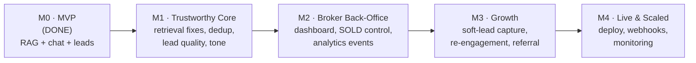

# Riya — Real Estate AI Agent · Master Product Plan

> **One-line vision:** A free-to-run, WhatsApp/Telegram/Web AI property consultant for Lucknow that
> finds the right home for a buyer through natural conversation, captures qualified leads, and hands
> brokers everything they need to close — with zero paid APIs.

**Owner:** Saubhagya Kashyap · **Market:** Lucknow residential resale/primary · **Status:** MVP working, hardening for production
**Last updated:** 2026-06-13

This is the top-level plan. It links to the detailed specs:

| Doc | What it covers |
|-----|----------------|
| [01_ARCHITECTURE.md](01_ARCHITECTURE.md) | System components + request/response flow diagrams |
| [02_DATA_MODEL.md](02_DATA_MODEL.md) | Supabase schema, ER diagram, every table & column |
| [03_CONVERSATION_FLOW.md](03_CONVERSATION_FLOW.md) | Dialog state machine, intent routing, the location-group model |
| [04_RAG_PIPELINE.md](04_RAG_PIPELINE.md) | Enrichment → embedding → hybrid retrieval → ranking |
| [05_BACKLOG.md](05_BACKLOG.md) | Prioritized backlog (buyer/analyst/owner findings) |
| [06_SETUP_RUNBOOK.md](06_SETUP_RUNBOOK.md) | Exact steps to set up, run, and deploy |

---

## 1. The problem & the bet

In tier-2 Indian cities, property search is broker-gatekept and opaque. Buyers WhatsApp 5 brokers,
get spammed, and still can't compare options. Brokers waste hours on tyre-kickers and lose serious
buyers to slow follow-up.

**The bet:** an always-on AI consultant that (a) answers like a knowledgeable human, (b) shows real,
honestly-described inventory with photos + map, and (c) only escalates to a broker when the lead is
genuinely warm — turning the broker's time from "qualify everyone" into "close the qualified."

## 2. Who it serves

| Persona | What they want | How we win them |
|---------|----------------|----------------|
| **Buyer** (first-home, 20L–1.5Cr) | Trust, photos, EMI clarity, no spam | Human tone, honesty when no match, EMI help, privacy promise |
| **Broker** (on-ground) | Warm leads with full context, no junk | Dedup, qualification, "what they liked", visit-time, dashboard |
| **Owner** (brokerage) | More closings, low cost, accurate inventory | Funnel analytics, SOLD control, free-tier stack |

## 3. Product principles (non-negotiable)

1. **Free-tier only.** Groq (LLM), HuggingFace local embeddings, Supabase free, Nominatim/Overpass,
   n8n self-host, `wa.me` links. No paid API ever enters the critical path.
2. **Honesty over conversion.** If there's no match, say so — then offer to source it. Never fabricate
   a price, distance, or amenity. (See accuracy guardrails in [04_RAG_PIPELINE.md](04_RAG_PIPELINE.md).)
3. **Capture the lead, respect the human.** Escalate at the right moment, reassure on privacy, never spam.
4. **One brain, many channels.** Web, Telegram, WhatsApp all call the same `process_message()` core.
5. **Every decision is measurable.** Funnel events table; we never guess where buyers drop.

## 4. Where we are (honest status)

**Working & verified (agent-function level):**
- Hybrid RAG retrieval (SQL filter + pgvector + re-rank), 110 enriched listings
- Natural multi-turn conversation: clarify → recommend → compare → lead capture
- Intent extraction with hallucination guards (no invented landmarks/areas)
- **Location-group switching** — changing area/landmark mid-chat now drops stale anchors (fixed 2026-06-13)
- Property comparison ("which is cheaper?", "compare 1 and 2")
- Honest availability notes; named-landmark live distance calculation
- Lead capture → Supabase + email/WhatsApp/n8n broker notification

**Not yet done (the gap to "industry grade"):**
- No browser/live-bot end-to-end test (only function-level verified)
- No lead dedup / fake-number guard
- Liked-property often not attached on direct "visit" intent
- No soft-lead ("WhatsApp these to me") capture path
- No broker dashboard; SOLD-marking code exists but is unwired
- No funnel analytics
- Buyer trust gaps: EMI help, photo/map prominence, privacy reassurance at the ask

Full prioritized list with fixes → [05_BACKLOG.md](05_BACKLOG.md).

## 5. Roadmap (milestones, not dates)



### M1 — Trustworthy Core *(in progress)*
The conversation must never mislead or break. Retrieval correctness, lead dedup + qualification,
fake-number guard, attach liked property + visit time, tone polish (kill repetition), privacy
reassurance, EMI helper. **Exit criteria:** a 15-turn adversarial conversation produces correct
results and a complete, deduped lead.

### M2 — Broker Back-Office
Wire the orphaned `get_leads_for_broker` / `mark_property_booked`. Static dashboard (leads list +
status buttons, mark-SOLD, edit price). Idempotent CSV upload (no duplicate listings). Funnel
`events` table. **Exit criteria:** a broker can run their whole day from the dashboard; owner can see funnel conversion.

### M3 — Growth (free-tier)
Soft-lead "WhatsApp these to me" path; no-match → "we'll source it" capture; n8n cold-lead
re-engagement; saved-search alerts; post-lead referral link. **Exit criteria:** ≥2 capture paths
beyond hard "visit" intent; one automated re-engagement loop live.

### M4 — Live & Scaled
Deploy to Railway free tier; permanent Telegram + WhatsApp webhooks; health checks; geocode caching;
rate limiting. **Exit criteria:** public URL, both bots live via webhook, basic monitoring.

## 6. Success metrics (define now, instrument in M2)

| Metric | Definition | Target signal |
|--------|-----------|---------------|
| Search-reach rate | sessions reaching first property card / sessions started | funnel health |
| Show→lead rate | leads / sessions that saw properties | core conversion |
| Soft-capture rate | soft leads / interested-but-not-visiting users | M3 lever working |
| Lead quality | % leads broker marks `contacted`→`visit`/`converted` | broker trust |
| Dedup rate | duplicate leads suppressed / total capture attempts | data integrity |
| Cost | ₹/month infra | must stay ₹0 |

## 7. Risks & mitigations

| Risk | Impact | Mitigation |
|------|--------|-----------|
| Free-tier limits (Groq RPM, Supabase 500MB, WhatsApp msg cap) | outage at volume | cache geocodes, rate-limit, monitor quotas in M4 |
| Wrong live geocode → false distance | reputation/RERA | "approx, confirm with consultant" phrasing + centroid-fallback rejection ([04](04_RAG_PIPELINE.md)) |
| Fake/spam leads | broker distrust | dedup + fake-number guard + optional WhatsApp reachability check |
| LLM hallucination | misinformation | grounded-only prompts, postprocess guards (done), comparison uses stored data only |
| Stale inventory shown | dead-end calls | SOLD-marking wired in M2 |
```
