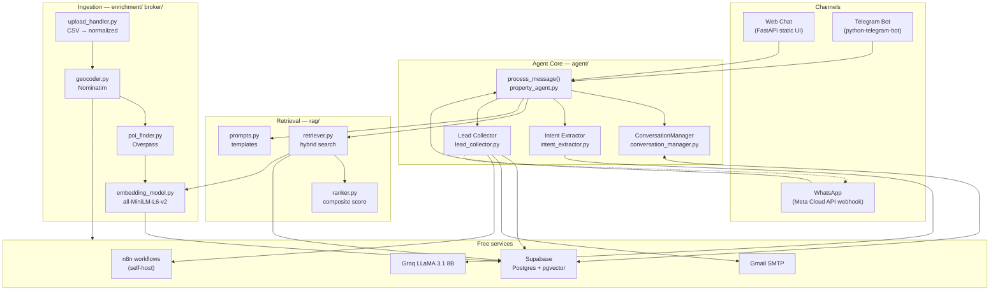
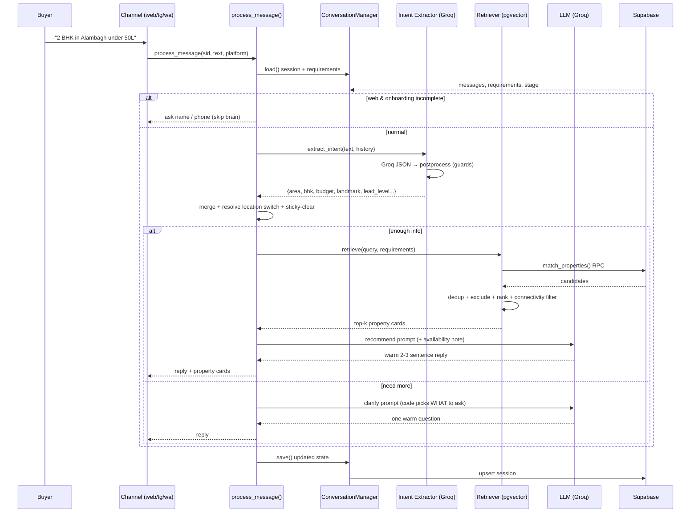
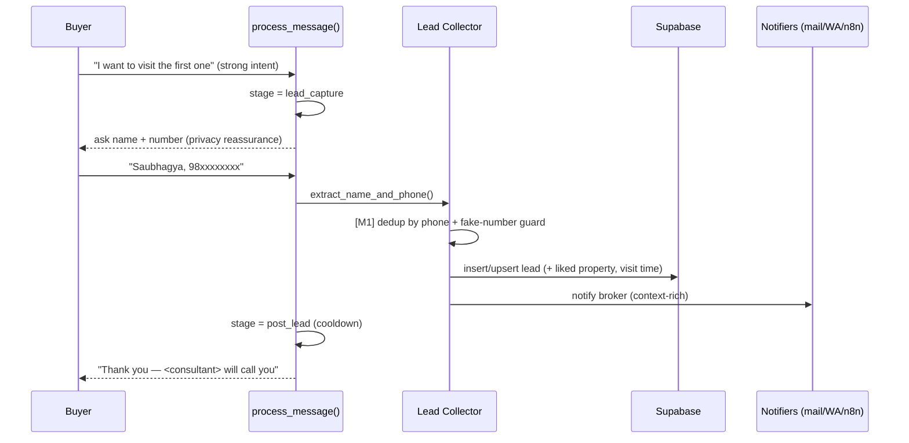

# 01 · System Architecture

> How the pieces fit, and how one message flows through them. All components are free-tier.

## 1. Component map

## 2. The three layers

| Layer | Dirs | Responsibility |
|-------|------|----------------|
| **Channels** | `interfaces/`, `api/` | Transport + platform onboarding. Thin — they only adapt I/O to `process_message()`. |
| **Agent core** | `agent/` | The brain. Dialogue state, intent, routing, lead capture. Channel-agnostic. |
| **Retrieval & data** | `rag/`, `database/`, `embeddings/` | Find matching properties; persist sessions & leads. |
| **Ingestion** | `broker/`, `enrichment/` | Turn a broker CSV into enriched, embedded, searchable listings. |

**Key design rule:** channels never contain business logic. Web onboarding is the one exception
(name→phone collected before the brain sees the message) and it lives in `property_agent.py` guarded by
`platform == "web"`, not in the API layer.

## 3. Runtime request flow (a buyer message)

## 4. Lead-capture sub-flow

## 5. Channel notes

- **Web** (`api/main.py`): serves an inline HTML chat UI at `/`, `POST /chat`, shortlist endpoints,
  image upload. Onboarding (name→phone) happens up front, before the brain.
- **Telegram** (`interfaces/telegram_bot.py`): `/start` onboarding, voice-note support, inline buttons.
  Can run polling locally *or* via `/webhook/telegram` when deployed.
- **WhatsApp** (`/webhook/whatsapp` in `api/main.py`): Meta Cloud API; outbound via `notifications/`.
  Needs a permanent token (see [06_SETUP_RUNBOOK.md](06_SETUP_RUNBOOK.md)).

## 6. Why these technology choices

| Need | Choice | Why (free + good enough) |
|------|--------|--------------------------|
| LLM | Groq LLaMA 3.1 8B Instant | 14.4k req/day free, fast; temp=0 for extraction |
| Embeddings | all-MiniLM-L6-v2 (local) | 384-dim, runs on CPU, no API cost |
| Vector DB | Supabase pgvector + ivfflat | free 500MB, SQL filters + cosine in one query |
| Geocoding | Nominatim | free 1 req/s; cache in M4 |
| POI distances | Overpass | free; computed once at ingestion |
| Broker automation | n8n self-host | free, visual workflows |
| Buyer/broker msgs | Gmail SMTP + `wa.me` | free; WhatsApp Cloud API free tier for outbound |

Detailed retrieval internals → [04_RAG_PIPELINE.md](04_RAG_PIPELINE.md).
Conversation routing internals → [03_CONVERSATION_FLOW.md](03_CONVERSATION_FLOW.md).
