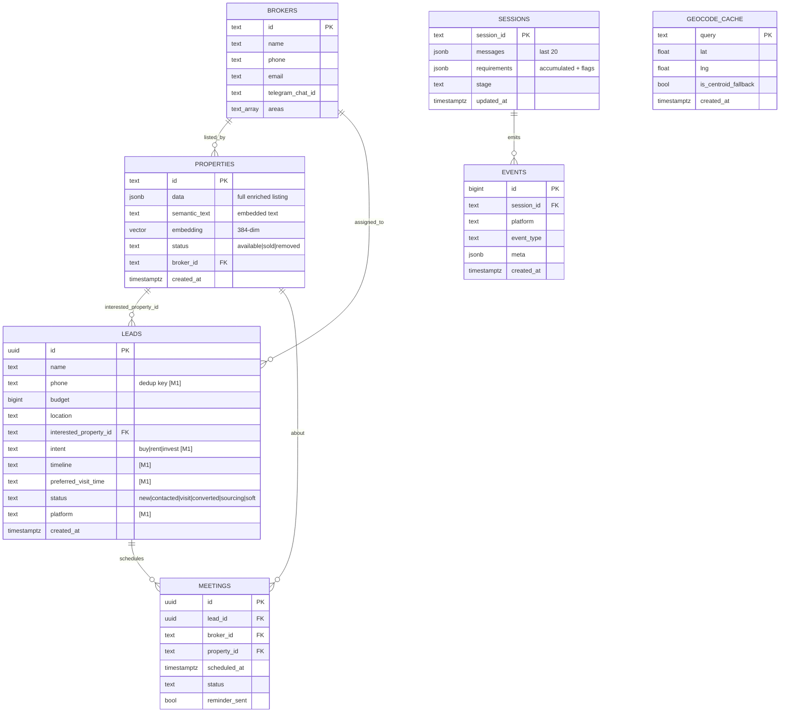

# 02 · Data Model

> Supabase Postgres + pgvector. Current tables are live; tables/columns marked **[M2]** / **[M3]**
> are planned additions from the backlog ([05_BACKLOG.md](05_BACKLOG.md)).

## 1. Entity-relationship diagram



`EVENTS` and `GEOCODE_CACHE` are **[M2]/[M4]** additions.

## 2. Tables in detail

### `properties` (live)
The heart of search. `data` holds the full enriched JSON; `embedding` is the searchable vector.

| Column | Type | Notes |
|--------|------|-------|
| `id` | text PK | deterministic per listing — **[M2]** derive from broker `external_ref` so re-upload upserts |
| `data` | jsonb | `property_profile`, `location`, `pricing`, `amenities`, `connectivity`, `images` |
| `semantic_text` | text | the string fed to the embedder (price in all units, type synonyms, area, POIs) |
| `embedding` | vector(384) | all-MiniLM-L6-v2; **ivfflat** index, `vector_cosine_ops` |
| `status` | text | `available` (default) / `sold` / `removed` — filtered in `match_properties` |
| `broker_id` | text FK | who listed it |

`data` JSON shape (abridged):
```jsonc
{
  "property_profile": { "bhk": 2, "property_type": "Flat", "builtup_area_sqft": 1125,
                         "furnishing": "Semi-furnished", "facing": "East",
                         "floor_info": { "current_floor": 3, "total_floors": 5 } },
  "location":  { "area_name": "Gomti Nagar", "city": "Lucknow" },
  "pricing":   { "total_price_inr": 5000000 },
  "amenities": ["Lift", "Power Backup", "Reserved Parking"],
  "connectivity": { "latitude": 26.85, "longitude": 80.99,
                    "metro_distance_km": 1.02, "metro_name": "...",
                    "hospital_distance_km": 2.1, "school_distance_km": 0.8 },
  "images": ["https://images.unsplash.com/photo-...?w=800&q=80&fit=crop&auto=format"]
}
```

### `leads` (live + [M1] columns)
What the broker acts on. **M1 hardens this:**
- `phone` → dedup key: before insert, look up same phone in last 24–48h and **update** instead of duplicating.
- `interested_property_id` → must be set on **strong** intent too (resolve "the first one" → concrete id), not only soft.
- New: `intent` (already extracted, currently dropped), `timeline`, `preferred_visit_time`, `platform`.
- `status` enum widened: `new | contacted | visit | converted | sourcing | soft`.

### `sessions` (live)
Conversation memory. `requirements` is the accumulated search state **plus internal flags** (prefixed `_`):
`_profile`, `_shown_ids`, `_last_shown_cards`, `_liked_property_id`, `_area_cleared`, `_budget_cleared`,
`_bhk_cleared`, `_post_lead_turns`, `_recommendation_count`. History capped at 20 messages.

> ⚠️ On web `__init__`, requirements are reset to `{_profile}` only — search state is fresh each session,
> profile (name/phone) persists. See [03_CONVERSATION_FLOW.md](03_CONVERSATION_FLOW.md).

### `brokers` (live)
`areas text[]` drives lead routing (match lead `location` to a broker covering that area).

### `meetings` (live, lightly used)
`get_upcoming_meetings` powers reminder workflows. `mark_property_booked` should fire here on conversion **[M2]**.

### `events` **[M2]**
The measurement backbone. One row per funnel transition. ~8 insert points in `_route`/`_recommend`:
`session_started, onboarding_phone_skipped, first_search, properties_shown, compared, nudged,
soft_lead, strong_lead, lead_saved`. Query funnel conversion with plain SQL. Tiny rows, free-tier safe.

### `geocode_cache` **[M4]**
Cache Nominatim results by normalized landmark name to (a) stop re-hitting the 1 req/s limit and
(b) let a human hand-correct a bad pin once. `is_centroid_fallback` flags low-confidence geocodes so
retrieval can reject them (accuracy guardrail — [04_RAG_PIPELINE.md](04_RAG_PIPELINE.md)).

## 3. The search RPC — `match_properties`

Stable SQL function doing hard-filter + cosine in one round trip:

```sql
select id, data, 1 - (embedding <=> query_embedding) as similarity
from properties
where status = 'available'
  and (filter_city is null or data->'location'->>'city' = filter_city)
  and (filter_max_price is null or (data->'pricing'->>'total_price_inr')::bigint <= filter_max_price)
  and (filter_min_price is null or (data->'pricing'->>'total_price_inr')::bigint >= filter_min_price)
  and (filter_bhk is null or (data->'property_profile'->>'bhk')::int = filter_bhk)
  and (filter_area is null or replace(data->'location'->>'area_name',' ','') ilike '%'||filter_area||'%')
  and 1 - (embedding <=> query_embedding) > match_threshold
order by embedding <=> query_embedding
limit match_count;
```

Note: the Python retriever passes `filter_max_price * 1.25` (buffer) and strips spaces from area for
ILIKE. Ranking/penalties happen in Python (`rag/ranker.py`) after this returns candidates.

## 4. Migrations

Live: `supabase/migrations/001_initial_schema.sql`.
Planned: `002_lead_quality.sql` (leads columns + phone index) **[M1]**, `003_events.sql` **[M2]**,
`004_geocode_cache.sql` **[M4]**. Keep migrations forward-only and idempotent (`if not exists`).
