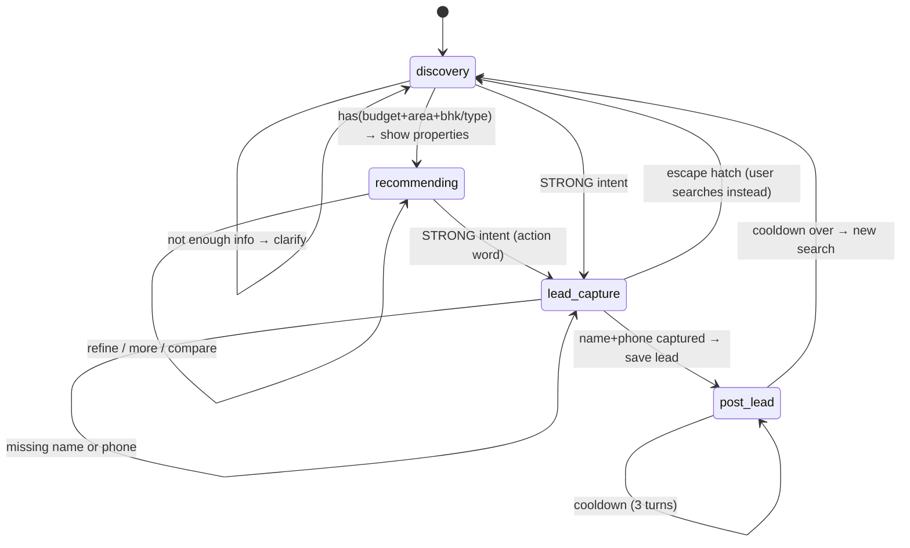
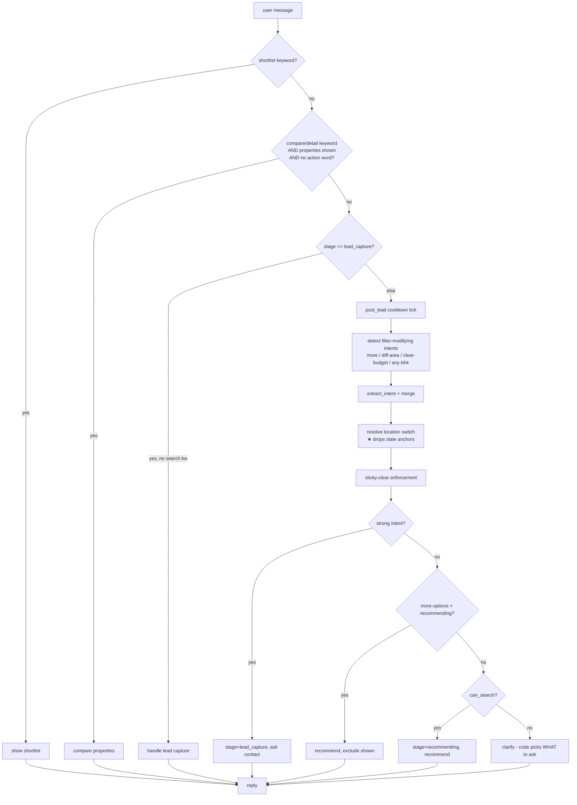
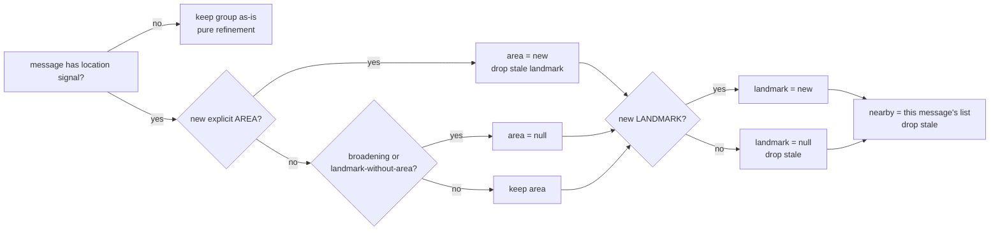

# 03 · Conversation Flow

> How `agent/property_agent.py` turns a raw message into the right action. This is the most
> bug-prone part of the system, so the rules here are deliberately explicit.

## 1. Dialogue state machine

Stages live on the session (`conversation_manager.py`). Valid: `discovery`, `recommending`,
`lead_capture`, `post_lead`, `done`.



`has_enough_info()` = `has(budget OR _budget_cleared) AND has(area OR _area_cleared) AND
has(bhk OR type OR _bhk_cleared)`. The `_cleared` flags let "no budget limit" / "any BHK" satisfy a slot.

## 2. Routing pipeline (`_route`)

Order matters — each guard short-circuits. This is the actual sequence:



## 3. Intent extraction & the guards that keep it honest

`intent_extractor.py` calls Groq (temp=0, JSON mode), then `_postprocess()` applies **code-level guards**
that override LLM mistakes. These are load-bearing — do not remove without replacing:

| Guard | Fixes |
|-------|-------|
| Lakh/crore unit correction | "15 lakh" extracted as 15.0 → 0.15 |
| Same min==max resolution | "budget 15 lakh" → min=max=0.15 blocking everything → max only |
| Budget direction | "under X" put in min → swapped to max |
| **Hallucination drop** (`_tokens_in_message`) | LLM inventing landmark/nearby the user never typed |
| **Landmark-is-area** | area name wrongly put in `named_landmark` → moved to `area` |
| **Landmark fallback** (`_NEAR_PHRASE_RE`) | LLM missing a real place → "near phoenix united" still extracted |
| **Budget grounding** (`_HAS_DIGIT_RE`/`_BUDGET_WORD_RE`) | LLM re-emitting a history budget on a no-budget turn → creates `min==max`, filters out everything cheaper |
| **bhk sanity (1–10)** | nonsense like "0 BHK Shop" dropped |
| **Strong needs action word** (`_ACTION_WORDS_RE`) | "villa"/"yes" misclassified as strong → downgraded to soft |
| Area scan from message | catches areas the LLM missed |

### Lead intent levels
- **none** — searching or answering a question (most messages, incl. bare "villa", "2 BHK", area names)
- **soft** — engaged: "this looks good", "yes", "is it negotiable?" → show + nudge, track liked property
- **strong** — explicit action word (visit/book/schedule/contact) → lead capture

## 4. ★ The location-group model (the bug we kept hitting)

`area`, `named_landmark`, and `nearby` are **one logical group**: the buyer's current location focus.
They must NOT persist independently, or a stale anchor silently filters out every later search.

**The failure it prevents** (real reproduction):
```
"2 BHK in Alambagh"        → area=Alambagh
"near Sahara Hospital"     → landmark=Sahara Hospital, nearby=[hospital], area cleared
"what about Gomti Nagar"   → area=Gomti Nagar  ... but landmark STILL Sahara Hospital ❌
                              → searches Gomti Nagar properties near a Gomti landmark = wrong/empty
```

**The rule** (`_resolve_location_switch`), fires only when the message carries a location signal:



Only values **literally present in the current message** count (history re-extraction by the LLM is
ignored), mirroring the sticky-clear philosophy. Verified cases:

| Turn | area | landmark | nearby | ✓ |
|------|------|----------|--------|---|
| "2 BHK in Alambagh" | Alambagh | — | — | anchor set |
| "in Hazratganj instead" | Hazratganj | — | — | switched |
| "anything near Sahara Hospital" | — | Sahara Hospital | [hospital] | landmark anchor |
| "what about Gomti Nagar" | Gomti Nagar | **—** | **[]** | **stale dropped** |
| "under 40 lakh" | Gomti Nagar | — | — | refinement keeps loc |
| "near metro" | Gomti Nagar | — | [metro] | refinement adds nearby |

## 5. Sticky-clear enforcement

Separate from the location group: when a user explicitly clears a slot ("no budget limit", "any BHK",
"other areas"), a `_*_cleared` flag is set. The LLM sees history and may re-extract the old value — the
flag is lifted **only** if the current message literally contains the relevant keyword
(a price+unit, a BHK/type word, or a known area name). Otherwise the slot stays cleared.

## 6. Recommendation & honesty notes (`_recommend`)

After retrieval, before replying, the code computes an **availability note** (highest priority first):
1. **Landmark not found** — geocoding failed → "couldn't pinpoint X, here's best available"
2. Progressive fallback fired (dropped BHK, then budget, to find anything in the area)
3. **Area mismatch** — nothing in requested area → "no listings in X, showing nearby"
4. **Type mismatch** — asked villa, only flats → "no villas, closest alternatives" (flat/villa groups)
5. **Amenity mismatch** — requested amenity absent (connectivity items excluded — they're distance-filtered)

The note is injected into the LLM prompt so Riya tells the buyer the truth instead of pretending.

## 7. Comparison / detail (`_compare_properties`)

Triggers on "which is cheaper?", "compare 1 and 2", "tell me about property 3" — **only** when
properties are on screen and the message has **no action word** (so "I love #1, can I visit?" routes to
lead capture, not comparison). Answers strictly from `_last_shown_text` (no re-query, no invented data),
re-renders the same cards.

## 8. Lead capture (`_handle_lead_capture`)

Collects name+phone (channel onboarding may pre-fill). On success: save lead, notify broker, set
`post_lead` cooldown (3 turns) so the broker buttons / re-asks don't spam.

**M1 hardening (see [05_BACKLOG.md](05_BACKLOG.md)):** dedup by phone, fake-number guard, attach the
resolved liked-property id + a visit-time question, persist `intent`.
