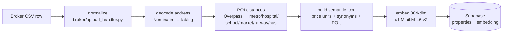
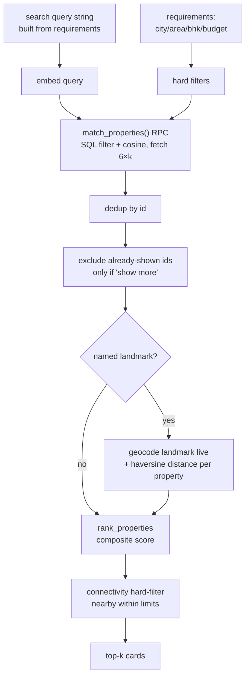

# 04 · RAG & Retrieval Pipeline

> From a broker's raw CSV to a ranked, honestly-described shortlist. All steps free-tier.

## 1. Ingestion (one-time per listing)

**Semantic text** (what gets embedded) deliberately includes redundancy so cosine match is robust:
price in every unit (lakh/lac/crore/cr), price-tier tags, area with and without spaces, and
property-type synonyms ("flat apartment home", "villa bungalow independent house").

**Connectivity** distances are computed **once at ingestion** and stored — search never pays for POI
lookups. (The one exception is a *named landmark* the buyer mentions at query time — §4.)

## 2. Query-time retrieval (`rag/retriever.py → retrieve()`)

### Hard filters (in SQL)
`status='available'`, city, `bhk`, `min_price`, **`max_price × 1.25`** (buffer so near-budget homes
appear; the ranker penalizes over-budget ones rather than hiding them), area ILIKE (spaces stripped).

### Why fetch 6× candidates
We over-fetch (`max(k*6, 30)`) so there's room to dedup duplicate rows, exclude already-shown ids on
"show more", inject landmark distances, and re-rank — and still return a full k.

### Progressive fallback (in `_recommend`, when 0 results but area given)
1. drop BHK + type (keep area + budget)
2. also drop budget (area only)
Each fallback sets an honest availability note so Riya explains what it widened.

## 3. Ranking (`rag/ranker.py`)

Composite score over candidates (weights approximate; tune empirically):

| Signal | Weight | Logic |
|--------|--------|-------|
| Vector similarity | ~40% | cosine from pgvector |
| Budget fit | ~25% | within budget = full; over-budget penalized by distance |
| Property-type match | ~15% | exact=100, same group (villa/house) = 75, wrong type = 15 |
| Location/area match | ~12% | requested area exact vs nearby |
| Amenity / connectivity match | ~8% | requested amenities & nearby present |

The type-group penalty is what makes "show me villas" rank actual villas above flats even when both
match the vector query — and drives the honest "no villas, here are flats" note when none exist.

## 4. Named-landmark live distance (the "near X" feature)

When the buyer names a **specific** place ("near Sahara Hospital", "near Phoenix United", "near Ekana
Stadium"):
1. **Robust extraction** — a code fallback (`intent_extractor._NEAR_PHRASE_RE`) catches the place even
   when the LLM misses it: any proper-noun phrase after near/around/close-to that is not a known area
   and not a purely generic word (metro/hospital/…) becomes `named_landmark`.
2. **Wide net, not vector-narrow** — when a landmark is present, geographic distance is the ranking
   signal, so the retriever fetches a large candidate set (`fetch_count=500`, threshold lowered to 0.05)
   instead of only the top-N most semantically similar. *This was the core bug:* with a small vector
   fetch, the actually-closest homes were cut off before their distance was ever computed.
3. Geocode the landmark **at query time** (Nominatim); haversine distance to every candidate's stored
   lat/lng.
4. Filter to `named_landmark_max_km` (default 3 km); **sort nearest-first**; if all filtered out, return
   unfiltered (don't 0-out).
5. The distance rides through to the property card (`landmark_name`, `landmark_distance_km`) and is shown
   as a green "🎯 X km from <place>" badge in the web UI.

**Confirmed working end-to-end (live HTTP):** "2 BHK under 60 lakh" → "anything near phoenix united" →
5 homes in Alambagh, **1.17 km from Phoenix United**, all within budget, nearest-first. Switching to
"near Ekana Stadium" recomputes live (4.31 km, different area) and drops the stale Phoenix anchor.

> ⚠️ Budget-grounding guard (paired fix): the LLM used to re-emit a budget from history on these
> location-only turns, silently creating `min==max` and filtering out everything cheaper. Budget
> extraction is now dropped when the message has no number/price word — see
> [03_CONVERSATION_FLOW.md §3](03_CONVERSATION_FLOW.md).

### ⚠️ Accuracy guardrails (M1/M4 — partly TODO)
Nominatim can return the *wrong* "CMS School" or a city-centroid fallback, producing a confidently-wrong
distance. Planned mitigations:
- **Soften phrasing** when distance came from a live geocode: "approximately X km — please confirm exact
  location with our consultant" instead of a hard number.
- **Reject centroid fallbacks**: if the geocode resolves to Lucknow's centroid, treat as "not found".
- **Cache** geocodes in `geocode_cache` (see [02_DATA_MODEL.md](02_DATA_MODEL.md)) to respect the 1 req/s
  limit and allow one-time human correction of bad pins.

Total geocode failure is already handled honestly (`named_landmark_not_found` tag → "couldn't pinpoint X").

## 5. The query string builder (`_build_search_query`)

Builds the embedding query from accumulated requirements (not the raw message — conversational turns
like "yes" would tank similarity). Adds type synonyms, area, budget phrasing ("affordable under N lakh"),
nearby and amenities. This is why a one-word "villa" still retrieves well — the query is reconstructed
from full state.

## 6. Image handling

`to_card()` ensures Unsplash URLs carry CDN params (`?w=800&q=80&fit=crop&auto=format`) so browsers load
them without redirect. **M3 idea:** download + re-host images in Supabase Storage so brokers control them
and they're not Unsplash placeholders. Buyer feedback flags photos as the #1 trust signal — surface them
prominently before the contact ask ([05_BACKLOG.md](05_BACKLOG.md)).

## 7. Free-tier budget watch (M4)

| Resource | Limit | Mitigation |
|----------|-------|-----------|
| Groq | 14.4k req/day | 1 extract + 1–2 generate per turn; fine at MVP volume |
| Supabase | 500 MB | listings are small; embeddings dominate — ~110×384 floats is trivial |
| Nominatim | 1 req/s | cache geocodes (M4); ingestion already throttled |
| pgvector ivfflat | — | rebuild index if listing count grows ≫ current 110 |
