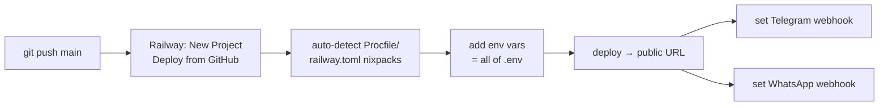

# 06 · Setup & Run Runbook

> Exact steps to set up locally, run, test, and deploy. Windows-first (PowerShell), since that's the dev box.

## 1. Prerequisites

- Python 3.11+ and the repo's `venv/` (already present)
- A `.env` file at repo root (gitignored — **never commit**) with:

```ini
SUPABASE_URL=https://zwfflbdazrbopeykifap.supabase.co
SUPABASE_KEY=...           # anon/service key
GROQ_API_KEY=...           # free at console.groq.com (fallback LLM)
GEMINI_API_KEY=...         # free at https://aistudio.google.com/apikey (primary LLM, optional)
GEMINI_MODEL=gemini-2.5-flash          # optional override
GROQ_MODEL=llama-3.3-70b-versatile     # optional override (fallback model)
TELEGRAM_BOT_TOKEN=...
GMAIL_ADDRESS=...          # for email lead alerts
GMAIL_APP_PASSWORD=...     # Google App Password (not your login)
WHATSAPP_PHONE_NUMBER_ID=...
WHATSAPP_ACCESS_TOKEN=...  # permanent token (see §6)
WHATSAPP_VERIFY_TOKEN=realestate_webhook_2026
WHATSAPP_BUSINESS_ACCOUNT_ID=...
N8N_LEAD_WEBHOOK_URL=http://localhost:5678/webhook/lead-notification
```

> **Security:** the DB password (`Saubhagya@15`) is for direct psycopg2 setup only — never store it in a
> committed file. API keys live only in `.env`.

## 2. Install

```powershell
.\venv\Scripts\python.exe -m pip install -r requirements.txt
```

## 3. Run locally

```powershell
# Terminal 1 — API + web chat (http://127.0.0.1:8000)
.\venv\Scripts\python.exe -m uvicorn api.main:app --port 8000

# Terminal 2 — Telegram bot (local polling)
.\venv\Scripts\python.exe interfaces/telegram_bot.py
```

> If port 8000 is stuck from an old run: `Get-Process python* | Stop-Process -Force` then restart.
> (pkill does not fully kill on Windows; stale servers serve stale code.)

## 4. Smoke-test the agent without a UI

```powershell
.\venv\Scripts\python.exe -c "from dotenv import load_dotenv; load_dotenv(); from agent.property_agent import process_message as p; import json; \
[print(p('demo','__init__','web')['reply']) or print(p('demo','Raj','web')['reply']) or print(p('demo','skip','web')['reply'])]; \
r=p('demo','2 BHK in Gomti Nagar under 50 lakh','web'); print(r['reply'], '| cards:', len(r['properties']))"
```

Expected: onboarding prompts, then a clarify or a recommendation with cards.

## 5. Conversation regression (run before every commit to agent/ or rag/)

A minimal harness that exercises the bug-prone paths:

```python
# scripts/regression_chat.py  (create if missing)
from dotenv import load_dotenv; load_dotenv()
from agent.property_agent import process_message as P
def run(sid, steps):
    P(sid,'__init__','web'); P(sid,'Raj','web'); P(sid,'skip','web')
    return [len(P(sid,m,'web').get('properties',[])) for m in steps]
print('standard   ', run('r1', ['50 lakh','Gomti Nagar','2 BHK']))            # → [0,0,2]
print('broaden    ', run('r2', ['20 lakh','alambagh','any would work','anything near metro']))
print('villa note ', run('r3', ['1 crore','Aliganj','villa']))               # → [...,5] (not 0)
print('loc switch ', run('r4', ['2 BHK 50 lakh in Alambagh','near Sahara Hospital','what about Gomti Nagar']))
print('show more  ', run('r5', ['under 50 lakh','Gomti Nagar','2 BHK','show more options']))
print('visit→lead ', run('r6', ['50 lakh','Gomti Nagar','2 BHK','can I visit the first one']))  # last → 0 cards (asks contact)
```

Pass = no scenario returns all zeros where properties exist, villa shows alternatives, loc-switch
follows the table in [03_CONVERSATION_FLOW.md §4](03_CONVERSATION_FLOW.md).

## 5b. LLM provider (Gemini primary, Groq fallback)

The bot routes every LLM call through `agent/llm_client.py`:
- **Primary:** Google Gemini Flash — free tier ~1,500 req/day, **1M tokens/min** (avoids the
  Groq rate-limit/429 issues). Get a free key (no card) at https://aistudio.google.com/apikey,
  put it in `.env` as `GEMINI_API_KEY`.
- **Fallback:** Groq Llama-3.3-70B — used automatically when `GEMINI_API_KEY` is unset or Gemini
  errors/rate-limits. Works today with just your existing `GROQ_API_KEY`.

No SDK needed for Gemini (called over REST via `requests`). To switch models, set `GEMINI_MODEL`
or `GROQ_MODEL` in `.env`. The bigger models also make far fewer extraction mistakes than the old
Llama-8B, which is why answer quality improves.

## 5c. Geocoding (named-landmark "near X")

`enrichment/geocoder.py` resolves a buyer's named place in this order: known-area dict → **Photon**
(komoot, OSM, free, no key, typo-tolerant POI search) → Nominatim. Photon resolves landmarks
Nominatim misses (Tunday Kababi, SGPGI, Bara Imambara, malls, stadiums) with no hardcoded list;
hits are cached at runtime. No setup needed — it just works.

## 6. WhatsApp permanent token (manual, one-time)

1. **business.facebook.com** → Settings → Users → **System Users** → Add (`RealEstateBotSystem`, Admin)
2. Add Assets → Apps → check `RealEstateBot` → Save
3. **Generate Token** → app `RealEstateBot` → permissions `whatsapp_business_messaging` +
   `whatsapp_business_management` → Generate (never expires)
4. Paste into `.env` `WHATSAPP_ACCESS_TOKEN=...`

## 7. Deploy to Railway (free tier)



1. `git add -A -- ':!.env'; git commit; git push origin main`
2. railway.app → New Project → Deploy from GitHub → this repo (detects `Procfile` + `railway.toml`)
3. Variables tab → add every key from `.env`
4. Deploy → note the URL (e.g. `https://...up.railway.app`); check `/health` → `{"status":"ok"}`
5. Telegram webhook (once):
   `curl "https://api.telegram.org/bot<TOKEN>/setWebhook?url=https://<RAILWAY-URL>/webhook/telegram"`
   then stop the local polling bot.
6. WhatsApp webhook: Meta dashboard → WhatsApp → Configuration → Callback
   `https://<RAILWAY-URL>/webhook/whatsapp`, verify token `realestate_webhook_2026`, subscribe `messages`.

## 8. Re-enriching / adding inventory

- Broker CSV columns: `property_type, bhk, price_inr, area_sqft, furnishing, address, city, amenities,
  broker_name, broker_phone` (+ `external_ref` once M2 idempotent upload lands).
- Pipeline: `broker/upload_handler.py` → geocode → POI → embed → Supabase. Connectivity fills automatically.

## 9. Operational notes

- **Supabase Storage bucket** `property-images` must exist (public) for image upload to work.
- **Session reset:** web `__init__` wipes search state but keeps `_profile`. To fully reset a tester,
  use a new `session_id`.
- **Free-tier watch:** Groq RPM, Supabase 500MB, Nominatim 1 req/s, WhatsApp msg cap — see
  [04_RAG_PIPELINE.md §7](04_RAG_PIPELINE.md).

## 10. Where things live

| You want to change… | Edit |
|---------------------|------|
| How Riya talks | `rag/prompts.py` |
| Routing / when to search vs ask | `agent/property_agent.py` (`_route`) |
| What gets extracted from a message | `agent/intent_extractor.py` |
| Search filters / ranking | `rag/retriever.py`, `rag/ranker.py` |
| Lead saving / broker alerts | `agent/lead_collector.py` |
| Web UI / endpoints | `api/main.py` |
| Telegram behavior | `interfaces/telegram_bot.py` |
| DB schema | `supabase/migrations/` |
